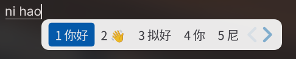
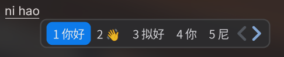
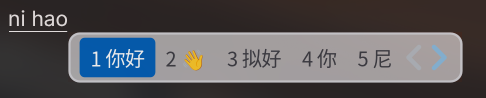

<div align="center">

# Fcitx5-MacOS-Theme

**macOS 风格的 Fcitx5 输入法候选框皮肤** · 浅色 / 深色 × 普通 / 动态模糊 共四套

让 Linux 桌面上的 Fcitx5 候选框看起来像 macOS 原生输入法。

</div>

<center>

**① 浅色 macOS-Light**



**② 深色 macOS-Dark**



**③ 浅色·动态模糊 macOS-Light-Blur**



**④ 深色·动态模糊 macOS-Dark-Blur**


</center>

## ✨ 特性

- 🍎 **macOS 原生质感** — 圆角候选面板 + 苹果系统蓝选中高亮，风格对标 macOS 输入法候选条
  - `macOS-Light`：白底浅色，选中项苹果蓝（`#007AFF`）
  - `macOS-Dark`：深灰底，选中项 macOS 深色系统蓝（`#0A84FF`）
- 🌫️ **动态模糊（Blur）变体** — `macOS-Light-Blur` / `macOS-Dark-Blur` 采用半透明面板，配合合成器的 `ext-background-effect` 实现候选框背后的实时毛玻璃（详见下方「动态模糊」）
- 🧼 **极简干净** — 无多余装饰，专注输入本身
- 🎨 **可高度定制** — 所有配色集中在各主题的 `theme.conf`，改一处即可换主题色
- ⚡ **纯 SVG 资源** — 面板、高亮、翻页箭头、单选/多选图标全部矢量绘制，任意 DPI 清晰渲染
- 🪶 **轻量** — 每个主题 7 个文件，几 KB 大小，不引入任何额外依赖

## 📁 文件结构

```
Fcitx5-MacOS-Theme/
├── LICENSE
├── README.md
├── preview-light.png         # macOS-Light 预览
├── preview-dark.png          # macOS-Dark 预览
├── preview-light-blur.png    # macOS-Light-Blur 预览
├── preview-dark-blur.png     # macOS-Dark-Blur 预览
└── themes/                   # 四套主题，目录名即主题名
    ├── macOS-Light/          # theme.conf + 6 个 svg
    ├── macOS-Dark/           # theme.conf + 6 个 svg
    ├── macOS-Light-Blur/     # 半透明面板 + EnableBlur
    └── macOS-Dark-Blur/      # 半透明面板 + EnableBlur
```

每套主题内含：`theme.conf`（配色/边距/布局）、`panel.svg`（面板）、`highlight.svg`（选中高亮）、`prev.svg` / `next.svg`（翻页箭头）、`arrow.svg`（子菜单箭头）、`radio.svg`（菜单单选）。

> **目录名即主题名**：Fcitx5 ClassicUI 的下拉框按 `themes/` 下的**目录名**识别主题，`theme.conf` 里的 `Name=` 仅作元数据显示。

## 🚀 安装

### 方式一：图形界面（推荐）

```bash
# 1. 一次性安装全部四套主题（目录名 = 主题名，勿改名）
mkdir -p ~/.local/share/fcitx5/themes
cp -r themes/* ~/.local/share/fcitx5/themes/

# 2. 打开 Fcitx5 设置 → 外观（Addons → Classic User Interface）
#    在「主题」下拉框选择 macOS-Light（或 macOS-Dark / *-Blur）
```

### 方式二：命令行

```bash
# 1. 安装主题
mkdir -p ~/.local/share/fcitx5/themes
cp -r themes/* ~/.local/share/fcitx5/themes/

# 2. 启用（跟随系统深浅自动切换；如需毛玻璃换成 *-Blur 版）
cat > ~/.config/fcitx5/conf/classicui.conf <<'EOF'
[Appearance]
Theme=macOS-Light
DarkTheme=macOS-Dark
UseDarkTheme=True
EOF

# 3. 重启 Fcitx5 生效
fcitx5-remote -r
```

> ⚠️ **关于主题名**：下拉框列出的是 `~/.local/share/fcitx5/themes/` 下的**目录名**，因此：
> - 保持 `themes/macOS-Light/` 等目录名不变（`cp -r themes/*` 即可）；
> - `Theme=` / `DarkTheme=` 填的也是这个目录名；
> - 不要把这些文件散放到根目录，否则下拉框里选不到。

如只想装某一套：

```bash
mkdir -p ~/.local/share/fcitx5/themes
cp -r themes/macOS-Dark-Blur ~/.local/share/fcitx5/themes/
echo -e "[Appearance]\nTheme=macOS-Dark-Blur" > ~/.config/fcitx5/conf/classicui.conf
fcitx5-remote -r
```

## 🌫️ 动态模糊（Blur 版）

`macOS-Light-Blur` / `macOS-Dark-Blur` 的面板是**半透明**的，并在 `theme.conf` 里设了 `EnableBlur=True`。要让候选框背后真正出现毛玻璃，需要同时满足三个条件：

1. **Wayland 会话**：Fcitx5 的模糊只在 Wayland 后端实现（X11 下无效）。
2. **合成器支持 `ext-background-effect` 协议**：例如 **niri**、KWin 6.x、Hyprland 等。
3. **Fcitx5 版本 ≥ 5.1.20**：5.1.19 及更早用的是 KWin 老协议 `org_kde_kwin_blur`，在 niri 上**不生效**；5.1.20 起才迁移到 `ext-background-effect`。

满足后，选 `macOS-Light-Blur` / `macOS-Dark-Blur` 即可看到候选框透出模糊的桌面背景。若你的环境不满足以上条件，请用普通版 `macOS-Light` / `macOS-Dark`（不透明，任何环境都正常显示）。

> 💡 部分合成器（如 niri）还可在其配置里对该 surface 显式开启 `background-effect { blur true; }`，作为兜底。

## 🎨 自定义

各主题的 `theme.conf` 是独立配色文件。关键字段对照：

| 字段 | 区域 | macOS-Light | macOS-Dark |
|------|------|-------------|------------|
| `NormalColor` | 普通候选文字 | `#3c3c43ff` | `#e5e5eaff` |
| `HighlightBackgroundColor` | 选中项高亮背景 | `#007affff` | `#0a84ffff` |
| `HighlightColor` | 选中项文字 | `#ffffffff` | `#ffffffff` |
| `CandidateLabelColor` | 普通序号 | `#3c3c43ff` | `#a0a0a8ff` |
| `CandidateCommentColor` | 候选注释 | `#6e6e73ff` | `#8e8e93ff` |
| `[Menu/Highlight] Color` | 菜单选中项 | `#007affff` | `#0a84ffff` |

- **改高亮色**：编辑 `[InputPanel] HighlightBackgroundColor`（`#RRGGBBAA`，末两位透明度）。
- **改模糊程度/透明度**：Blur 版的面板透明度在各自 `panel.svg` 的 `fill-opacity`（当前 `0.80`，越小越透）。

## 📄 许可证

采用 [MIT](./LICENSE) 许可证。Copyright (c) 2026 Become-ILLUSORY · Author 镜花水月。

---

<div align="center">
  Made with ♥ for the Linux input method community
</div>
